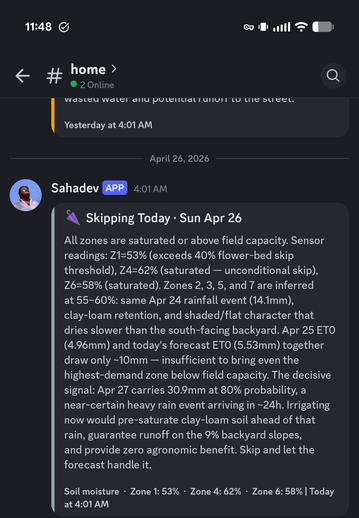

# sprinkler-ai

[](#safety)
[](https://www.python.org/)
[](LICENSE)
[](https://www.rainbird.com/)

> **AI-driven Rainbird irrigation scheduler.** Optional camera vision,
> soil-moisture sensing, and a Discord bot that diagnoses lawn photos.

> ⚠️ **Alpha** — single-author, early days. The control loop *will* turn your
> sprinklers on. Run `--dry-run` for a week first. MIT, no warranty.

<p align="center">
  
</p>

A small Python service that runs on any always-on Linux box and replaces your
Rainbird's static schedule with a daily AI-decided plan. Once a morning it asks
Claude how many minutes each zone should run, fed weather, ET, soil-probe data,
camera vision, and the last 14 days of decisions.

## Features

- **Per-zone minutes** based on sun, slope, soil, plant type, and a 5-round
  refinement loop that pushes past the AI's instinct to over-water
- **Cycle-and-soak** for sloped zones (splits long runs into pulses with
  infiltration pauses)
- **Forecast-aware** — skips today if rain >5 mm is likely in 48 h
- **Hardware rain-sensor short-circuit** — if it's wet, exits before any LLM call
- **Time-of-day rule** — refuses to water at 4 pm on cool-season turf (fungal risk)
- **Discord notifications** — rich daily-plan embeds + on-demand `!diagnose`
  bot for lawn photos
- **Optional camera vision** (Nest) — daylight snapshots through Claude Vision
  flag drought, over-watering, broken heads, mow-overdue
- **Optional soil moisture** (Ecowitt WH51) — direct VWC% becomes the primary
  signal for sensored zones
- **Lawn-care recommendations** — mowing, fertilization, pre-emergent timing,
  pest/disease watch, only when the data says now
- **Gemini fallback** — auto-switches if the `claude` CLI fails
- **JSONL history** — every decision logged for the next plan to learn from

## What a daily plan looks like

Posted to Discord every morning at 4 am:

```
💧  Sprinkler Plan · Mon Jul 13
Skipping zones 1, 3, 7 — 14 mm rain forecast Wed/Thu covers them. Watering
zones 4 and 5 at minimum to bridge until rain arrives.

Zone 4  ·  Backyard lawn
  12 min total — 3 × 4 min + 15 min soak
  9% slope; cycle-and-soak prevents runoff

Zone 5  ·  Backyard lawn (south)
  8 min — full sun, soil at 24% (deficient)

🌱 Lawn Care
  🟡  Mow before Wednesday
      Forecast 14 mm rain Wed/Thu — get ahead of it; turf is at 4″.

Total: 20 min across 2 zones · Soil moisture · Zone 4: 28%  ·  Zone 5: 24%
```

## Quickstart

```bash
git clone https://github.com/tejasphatak/sahadev-the-lawnbot.git sprinkler-ai
cd sprinkler-ai && ./install.sh           # venv + deps + interactive config wizard
.venv/bin/sprinkler-ai --dry-run          # test — never touches the controller
```

Once the dry-run plans look right, enable the daily timer:

```bash
mkdir -p ~/.config/systemd/user
cp contrib/sprinkler-ai.{service,timer} ~/.config/systemd/user/
sudo loginctl enable-linger $USER
systemctl --user enable --now sprinkler-ai.timer
```

Logs: `journalctl --user -u sprinkler-ai.service`.

**Requirements:** Python 3.11+, a Linux box on the controller's network, the
[`claude` CLI](https://claude.ai/code) signed in, a Rainbird ESP with LNK Wi-Fi.

## Optional add-ons

| | Setup time | Doc |
|---|---|---|
| Discord webhook (notifications) | 1 min | [docs/discord-setup.md](docs/discord-setup.md) |
| Discord bot (`!diagnose` photos) | 5 min | [docs/discord-setup.md](docs/discord-setup.md) |
| Ecowitt GW1200 + WH51 soil probes | local IP in `config.yaml` | — |
| Nest cameras (vision) | $5 + OAuth dance | [docs/nest-setup.md](docs/nest-setup.md) |

## Configure

Either run `sprinkler-ai-init` for the wizard, or copy and edit by hand:

```bash
cp config.example.yaml config.yaml
cp .env.example .env
```

Both files are gitignored. They hold zone descriptions, location, controller
credentials, and any optional service tokens.

## Why the `claude` CLI instead of the API?

One LLM call a day on your existing Claude subscription — no API key, no
per-token billing. Auto-falls back to `gemini` if Claude fails.

## FAQ

**Why not just use Rachio?** Rachio is a great product. sprinkler-ai is for
people who already own a Rainbird and want a smarter brain in front of it
without re-wiring — and who like the idea of an AI prompt they can read and
tune.

**Does Claude need an API key?** No. The planner shells out to your local
`claude` CLI and uses your existing subscription. One LLM call a day.

**What if the AI is wrong?** The hardware rain sensor is trusted before any
LLM call (skip + exit if wet). Every plan is logged. `--dry-run` lets you
shadow the automation indefinitely.

**Can I use it for warm-season turf (Bermuda, St. Augustine, Zoysia)?** Yes —
the prompt adapts based on the `grass_type` you set in `config.yaml`. Disease
and seasonal advice changes accordingly. Tested mainly on cool-season fescue;
PRs welcome for warm-season tuning.

**Does the camera vision work without Nest?** No, only Nest is wired up today.
Other backends (Wyze, Ring, generic RTSP) would be small contributions —
see [src/sprinkler_ai/nest.py](src/sprinkler_ai/nest.py).

## Roadmap

Short list of what's next, in rough priority order:

- [ ] Smoke-test suite (mock Rainbird + Open-Meteo, golden-file the planner)
- [ ] Hard daily-minute cap as a config option
- [ ] Other controller backends (Hunter Hydrawise, OpenSprinkler, Rachio) as
      optional modules; Rainbird stays the reference
- [ ] Generic RTSP / ONVIF camera backend (replace Nest-only vision)
- [ ] Warm-season turf prompt translations + community-contributed presets
- [ ] Property-boundary tuning via SAM-style segmentation before vision call

## Safety

- Run `--dry-run` for ≥1 week before enabling the timer. Compare plans against
  your gut on hot days, rainy days, post-mow days.
- The hardware rain sensor is the safety floor — wet ⇒ exits before any LLM call.
- **No hard minute cap.** The prompt steers toward the minimum, but watch the
  first month's `journalctl` for sanity.
- Don't commit `.env` or `config.yaml` (gitignored).

## Contributing

Issues and PRs welcome. Things that fit: other controller backends (Hunter,
OpenSprinkler, Rachio) as optional modules with Rainbird as the reference; more
soil-sensor backends; warm-season turf prompt translations; better property-
boundary detection in vision.

MIT — see [LICENSE](LICENSE).
